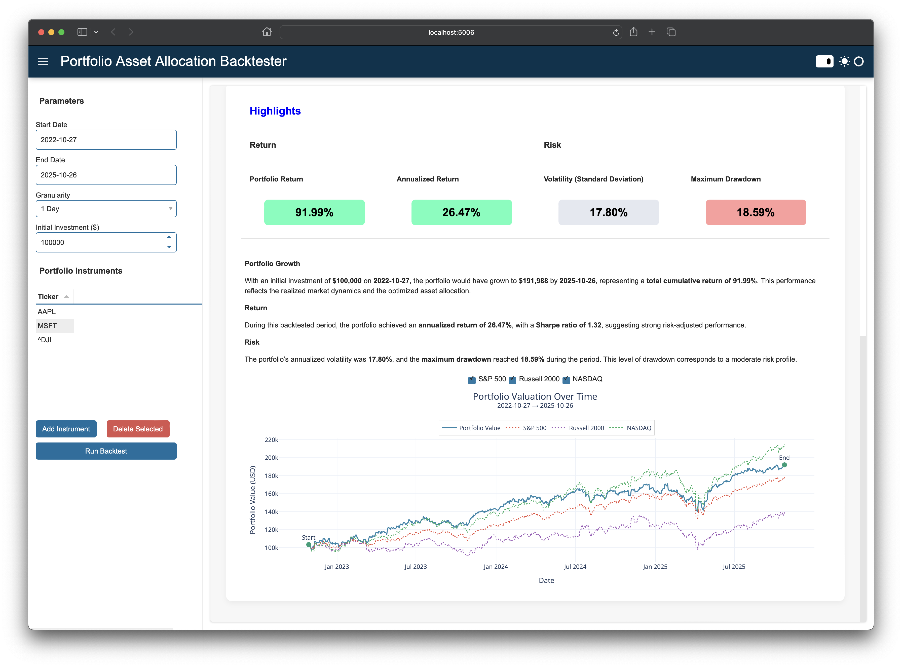

# portfolio-asset-allocation-backtester
This online app allows you to compute and backtest the optimal asset allocation of a portfolio. The allocation is computed by maximizing the Sharpe ratio.


## Installation

1. Make sure you have Python 3.11 installed on your machine.

2. Install [poetry](https://python-poetry.org)

3. Install the project:

    ```zsh
    poetry install
    ```

## Run the App Locally

To run the app, use the following command line:

```zsh
poetry run alloc
```

## Deployment of the Portfolio Allocation Backtester App with Docker

This app can be fully deployed with the associated Dockerfile. To do so, build the image first (once building is done, it will automatically run the app):

```zsh
./run_docker.sh --build --platform linux/amd64
```

The `--platform` argument takes either `linux/amd64` or `linux/arm64` depending on your machine.

If the docker image has already been built simply run:

```zsh
./run_docker.sh
```

## Previews

A couple of screenshots of this web application.




